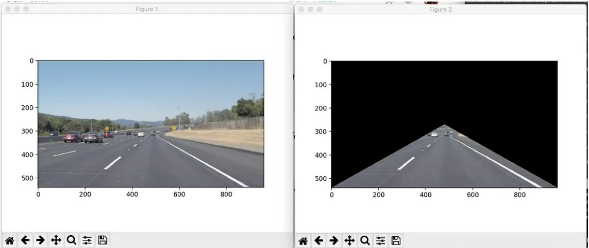

# IAA_2024
Auteurs : Bastien Pillonel, Rachel Leupi

## Objectif : 
Ce laboratoire consiste en la création d'une application utilisant l'intelligence artificielle pour permettre à notre drone de suivre une ligne blanche collée sur le sol.

## 1) Dataset : 
Nous avons fait le choix de créer notre propre dataset. Celui-ci comporte 23 images de lignes blanches prises sous plusieurs types de sol, d'angles et de luminosités.

Toutes les images ont été converties en niveaux de gris pour faciliter le traitement de celles-ci. Afin d'étendre le dataset, 4 rotations ont été appliquées sur chaque image pour augmenter la précision notre modèle ainsi notre dataset comporte 92 images.

## 2) Detection de ligne blanche : 

Dans le but d'entrainer notre model nous avons besoin d'associer les images avec leur ligne blanche soit un vecteur.

Pour cela nous nous sommes basé sur le tuto suivant : [Tutoriel](https://medium.com/@mrhwick/simple-lane-detection-with-opencv-bfeb6ae54ec0)

En voici un court résumé : 
1. On effectue une Canny edge detection sur l'image pour y detecter tout les contours.

2. On rogne l'image on la ligne blanche n'a peu voir aucune chance de se situé. Pour enlever un maximun d'élément annexe afin de facilité le traitement par la suite.
Pour cela nous récupérons un triangle en bas de l'image. 
voir exemple si dessous : 

3. On y applique la transformée de Hough qui permet de déterminé une ligne créer par les pixels alentour qui vont dans la même direction.

4. une fois le vecteur detecter il ne reste plus qu'a appliqué un masque avec ce vecteur sur l'image original.

Voici le résultat d'une image après tout les traitements effectués:

Il ne reste plus qu'à annoté toute nos image en grayscale. 

## 3) Algorithme de regression CNN

### Creation du dataset & dataloader 

