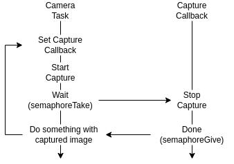

# IAA LAB03 Drone communications
## Author : Bastien Pillonel & Rachel Leupi
## Date : 23.04.2024

### Objectives :
The objectif of this lab is to implement functionnalities on the GAP8 and STM32. We will implement PC connection as well.

### 2. Transfer information from UART to STM32 :
In this part it was ask to us to implement a c function designed to facilitate communication between a GAP8 processor and an STM32 microcontroller via UART. 

Its primary objectives include retrieving frequencies related to the FC from the GAP8 processor and transmitting them to the STM32 microcontroller. Upon execution, the function retrieves the FC frequencies using pi_freq_get() function, and then constructs a CPXPacket_t packet to encapsulate the frequency data for transmission. 

It's noteworthy that a corresponding program on the STM32 side is required to read the UART data.

- **What is the value of the FC frequency ?**

The value of fc Frequency is 50MHz:


### 3. Create a WIFI Task :

- **In the CfClient console do you only see your prints ? If not, explain the other prints.**

- **What part of the data flow is responsible for these ?**

- **What happens when you connect 2 clients to the GAP8 ? Is it an expected behavior ?**

### 4. Image acquisition :

For this task we followed the tutorial in the README file.
We implement this solution, the one proposed for this lab :

 

The camera_task function orchestrates the acquisition and transmission of images. Initially, it sets up a delay to ensure system stability before starting its operations. It allocates memory for the image buffer and initializes the camera for image capture. Utilizing a semaphore for synchronization, it initiates image capturing asynchronously and awaits its completion. Upon capture completion, the image undergoes resizing to fit specific requirements. Subsequently, if a client is connected, the function transmits the resized image via Wi-Fi.

### 5. Transfer information from GAP 8 to PC via Wifi :

- **What is the max packet size ?**

The maximum packet size is determined by the underlying communication protocol and the network infrastructure being used. In this case, since the communication is happening over WiFi, the maximum packet size is typically determined by the Maximum Transmission Unit (MTU) of the WiFi network. The MTU defines the maximum size of a packet that can be transmitted over the network without fragmentation.

- **Explain your implementation of the communication protocol.**

we  created a function that creates a header packet containing information about the image captured by the drone. This includes metadata such as width, height, depth, type, and size of the image.

We use the ```sendBufferViaCPXBlocking``` function then to send the header to the route configured before with ```cpxInitRoute(CPX_T_GAP8, CPX_T_WIFI_HOST, CPX_F_APP, &txp.route)```. This function sends the packet over the WiFi connection to the designated host (in this case, a PC).

Following the transmission of header information, the actual image data is sent using the sendBufferViaCPXBlocking function. This function  sends the image data buffer over the same WiFi connection to the PC.

The communication protocol seems to be based on the CPX (Cyclops-P7) protocol, which is a proprietary protocol for communication between the drone (or other devices) and a host system (in this case, a PC) over a WiFi connection.

### 6. Image processing : 

### TASK 3

— In the CfClient console do you only see your prints ? If not, explain the other prints.

****

— What part of the data flow is responsible for these ?

****

— What happens when you connect 2 clients to the GAP8 ? Is it an expected behavior ?

**If I connect another client to the drone nothing happens or is printed**

