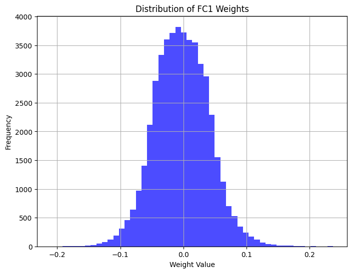

# IAA LAB04 Byte-Sized Brains : The Pocket AI Lab
## Author : Bastien Pillonel & Rachel Leupi
## Date : 07.05.2024

### 4 Stage 1 : Weights quantization

Essentially, weight quantization involves the process of reducing the precision of numerical values representing the parameters (weights) of a neural network, typically from floating-point to lower-bit fixed-point representations. To complete this stage, follow these steps :

- **Visualize the weight distribution of every convolutional and fully connected layer. Use histo-grams.**

Also in the Notebook.

- **Record the range of the weights, as well as their 3-sigma range (the difference between μ−3σ and μ+3σ).**

Range of weights : `[-0.2094, 0.2370]`

3-sigma range of weights : `[-0.1314, 0.1260]`

- **Implement the function quantized_weights.**

- **Explain which range you used for your quantization. Does range have an impact on model performance in this case ? Explain your answer.**

- **Do you observe a drop in the general accuracy ? If you did everything right it should be negligible. Explain your findings.**

- **Compare the memory footprint of the original model and the quantized one. Did the memory footprint change ? Explain your findings. You can use torchinfo or torch-summary to get the memory footprint.**